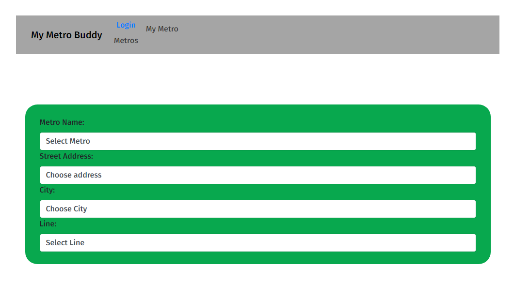

# My Metro BUddy
  

  ## Description
  The Washington D.C. Metro can be a unnavigable maze that some cannot traverse. Using My Metro Buddy will allow these users to not only navigate the metro, but also will allow for them to plan a trip better. Metro Buddy will help by allowing the user to save their closets station to them and give accurate time to destination on planned and saved trips.

  ## Table of Contents
  1. [Introduction](##Description)
  3. [Installation](##Installation)
  4. [Site](##Site)
  5. [Licenses](##Licenses)
  6. [Contribution](##Contribution)
  7. [Tests](##Tests)
  8. [Contact](##Contact)

  ## Installation
  1. Download the zip file and extract it. 
  2. In mySQL, create a database using the schema found in the db folder. 
  3. Create a dotenv file in the file and fill it with your SQL data that would lead to the database. 
  4. Installing all appropriate packages to run this program through your npm by running "npm i" in the command line on the file. 
  5. Seed the data needed by running "npm seed".
  6. Spin up a localhost server of the program by running "npm start".

  ## Site
  [Working Site](https://github.com/kaylacasale)

  

  ## Licenses
  This program is not under any license

  ## Technologies
    bcrypt 5.1.0
    connect-session-sequelize 7.1.5
    dayjs 1.11.7
    dotenv 16.0.3
    express 4.18.2
    express-handlebars 6.0.6
    express-session 1.17.3
    handlebars 4.7.7
    mysql2 3.0.1
    sequelize 6.28.0

  ## Tests
  There is currently no tests built into the program.

  ## Credits
  [Kayla Casale](https://github.com/kaylacasale)

  [Danielle Okia](https://github.com/Danielleokia)

  [Adam Stovall](https://github.com/AHStovall)

  [Kevin Moreno](https://github.com/ClassyKD)